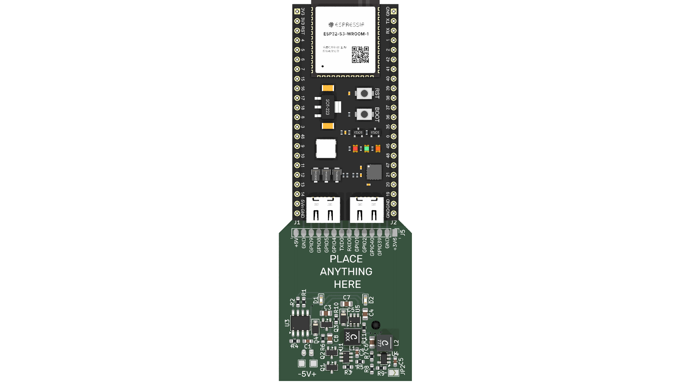

# Addon Battery YD-ESP32-S3

The idea for this module arose from the need to provide autonomy to my **ESP32-S3 modules from the manufacturer VCC-GND**, one of the most popular development kits for the [ESP32](https://s.click.aliexpress.com/e/_c3trfFHh) outside of Espressif itself.

This module provides autonomy to the **YD-ESP32-S3** development board, integrating a rechargeable 18650 battery with charge control, protection, and regulated outputs. It also exposes a 14-pin connector with 5V and 3.3V voltages and some GPIOs for connecting sensors or other peripherals.

|                                 |                                 |
| :-----------------------------: | :-----------------------------: |
|  |  |

---

## Main features

- **Battery**: Rechargeable 18650 cell (Li-Ion).
- **Charging Management**:
  - Integrated **TP4056** for USB charging.
  - Standard charging current (1A max, configurable with resistor).
- **Battery Protection**:
- **DW01A + dual MOSFET** circuit for overcharge, overdischarge, and overcurrent.
- **Power Supplies**:
- **Regulated 5V**: Constant output to power the YD-ESP32-S3 board.
- **Regulated 3.3V** (optional): Available for low-voltage sensors and peripherals.
- **14-pin Expansion Connector**:
- **5V** and **3.3V** outputs.
  - Some exposed **GPIOs** of the ESP32-S3.
  - Common GND.


## 14-pin connector pinout

| Pin | Señal  | Descripción                           |
| --- | ------ | ------------------------------------- |
| 1   | 3.3V   | Salida regulada 3.3V (opcional)       |
| 2   | GND    | GND                                   |
| 3   | GPIO39 | GPIO de la ESP32-S3                   |
| 4   | GPIO40 | GPIO de la ESP32-S3                   |
| 5   | GPIO2  | GPIO de la ESP32-S3                   |
| 6   | GPIO1  | GPIO de la ESP32-S3                   |
| 7   | RXD0   |                                       |
| 8   | TXD0   |                                       |
| 9   | GPIO4  | GPIO de la ESP32-S3                   |
| 10  | GPIO5  | GPIO de la ESP32-S3                   |
| 11  | GPIO8  | GPIO de la ESP32-S3                   |
| 12  | GPIO9  | GPIO de la ESP32-S3                   |
| 13  | GND    | Tierra común                          |
| 14  | 5V     | Salida regulada 5V (para la ESP32-S3) |

*(The exposed GPIOs depend on the assignment you choose in the PCB layout, here they are indicated as placeholders `GPIOx`, `GPIOy`, etc.)*

---

## Considerations

- The module is intended for **standalone use** in projects involving the YD-ESP32-S3.
- The **5V output must always be available**, as it is the primary power source for the ESP32-S3.
- The **3.3V output is optional** and is primarily intended for low-power sensors.
- The protection circuit prevents battery damage, but it is recommended to always use **quality 18650 cells with internal protection**.

## Future improvements

- Support for solar panel charging (MPPT or "solar-friendly" charger).
- Integration of an I²C fuel gauge (e.g., MAX17048) to report battery level.
- General on/off switch.
- Ultra-low-power modes for long-running projects.

## Generate panel

To do this it is required [Kikit](https://github.com/yaqwsx/KiKit?tab=readme-ov-file)

```sh
kikit panelize \
    --layout 'grid; rows: 6; cols: 2; space: 2mm' \
    --tabs 'fixed; width: 3mm; vcount: 2' \
    --cuts 'mousebites; drill: 0.5mm; spacing: 1mm; offset: 0.2mm; prolong: 0.5mm' \
    --framing 'railstb; width: 5mm; space: 3mm;' \
    --tooling '3hole; hoffset: 2.5mm; voffset: 2.5mm; size: 1.5mm' \
    --fiducials '3fid; hoffset: 5mm; voffset: 2.5mm; coppersize: 2mm; opening: 1mm;' \
    --text 'simple; text: MaykolRey.com; anchor: mt; voffset: 2.5mm; hjustify: center; vjustify: center;' \
    --text2 'simple; text: Created on {date}; anchor: mb; voffset: -2.5mm; hjustify: center; vjustify: center;' \
    --post 'millradius: 1mm' \
    addon-yd-esp32s3.kicad_pcb panel/panel.kicad_pcb
```
## Licence

Author: Maykol Rey